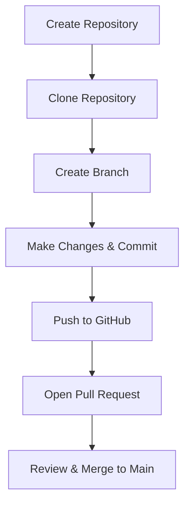

# File Management with GitHub

## 1. Introduction
GitHub is a platform for hosting and managing code using Git.  
It allows developers to collaborate, track changes, and manage project files effectively.

---

## 2. Key Concepts

### 2.1 Repository
- A repository (repo) is a storage space for project files.
- It contains source code, documentation, and history of changes.

### 2.2 Commit
- A snapshot of changes made to files.
- Each commit has a unique ID and message for tracking.

### 2.3 Branch
- A branch is a copy of the codebase where you can make changes independently.
- The default branch is usually **main** or **master**.

### 2.4 Merge
- Combines changes from one branch into another.
- Often used when features are completed and ready for production.

### 2.5 Pull Request (PR)
- A request to merge changes from one branch to another.
- Used for code reviews and collaboration.

---

## 3. File Management Operations

### 3.1 Creating a Repository
1. Go to GitHub → **New Repository**.
2. Add a repository name and description.
3. Choose visibility (public or private).
4. Initialize with README if needed.

### 3.2 Adding Files
- Upload files directly through GitHub web interface.
- Or use Git commands:
  ```bash
  git add filename
  git commit -m "Add new file"
  git push origin main
  ```

### 3.3 Updating Files
- Modify the file locally or in the GitHub editor.
- Commit and push changes to update in the repository.

### 3.4 Deleting Files
- Select the file in the GitHub UI → **Delete this file**.
- Or use Git:
  ```bash
  git rm filename
  git commit -m "Delete file"
  git push origin main
  ```

---

## 4. Collaboration & Version Control

- **Forking**: Create your own copy of a repository.
- **Cloning**: Download a repository to your local machine.
- **Issues**: Track bugs, tasks, or feature requests.
- **Code Review**: Use pull requests for peer review before merging.

---

## 5. Visual Workflow

### 5.1 Basic GitHub Workflow


### 5.2 File Management Lifecycle


---

## 6. Best Practices
- Always write clear commit messages.
- Use branches for new features or bug fixes.
- Keep the repository organized with folders and README files.
- Regularly pull updates when working in teams.
- Use `.gitignore` to exclude unnecessary files.

---

## 7. Conclusion
File management with GitHub ensures:
- Easy tracking of changes.
- Collaboration among developers.
- Organized project structures.
- Safe backup of files in the cloud.

---
